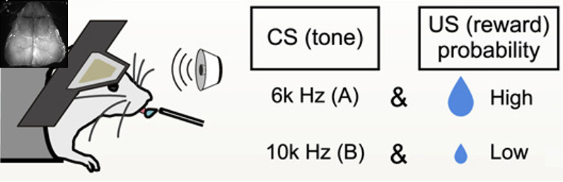
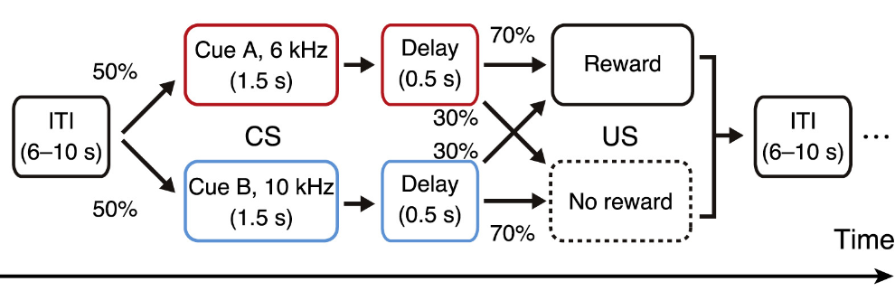
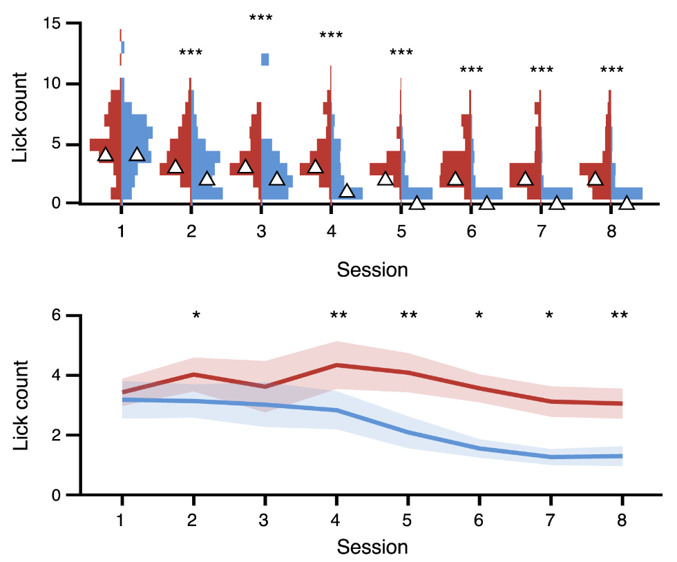

- Animal: Mouse
- Brain regions: Whole Cortex
- Experiments: Body Camera, Face Camera, Lever-pull, Wide field 1p
- Task: Classical Conditioning, Learning Process
- Publication date: August 25, 2022
- Authors: Masanori Matsuzaki, Masashi Kondo
- Data size (GB): 612
- Indivisuals: 2
- Session: 34

## Abstract

頭部固定マウスに対して古典的条件づけ実験を行った。条件刺激(CS)として6kHzと10kHzの2種類の異なる音を提示し、無条件刺激(US)として6kHzの場合70%の確率で水を報酬として供給、10kHzの場合30%の確率で水を報酬として供給した。この実験を2個体のマウスに対して30分間程度、合計17日間行うことで、古典条件づけの学習過程を記録した。この記録実験において、脳活動をCa2+プローブを使い広視野1光子顕微鏡（Wide-field 1p）により皮質全体の計測を行った。さらにマウスの顔および上半身のビデオデータ(Face Camera, Body Camera)の計測を行った。またマウスの行動データとしてリックや報酬のタイミングの計測した(Behavior data)。

Kondo et. al. 2021では、同様のパラダイムでは古典条件づけの**学習後のみ**の1光子イメージと2光子イメージの神経活動の解析を行った結果、背側前頭皮質内側部（dmFrC）が報酬期待行動における起始点であることが分かった。今回、共有予定のComplete datasetでは計測方法などはKondo et. al. 2021と共通した上で、その学習にいたるまでにどのように脳内の活動が変化していくかを計測した。

## Complete dataset

### Download

現在は東京大学松崎研究室との共同研究、もしくは学術変革領域A「行動変容生物学」内での内部共有を想定した配布を行っています。共有者にはData Descriptionのディレクトリ構造とファイルにアクセスするためのリンクを送付しますので各自でダウンロードしてください。

学術変革領域A「行動変容生物学」後期の公募班の募集のタイミングを目処にCreative Commonsライセンスでの一般公開を予定しています。ただし、予定は変更になる可能性があります。

### Data License

共同研究を想定していますので、必要な場合は事務局に相談をお願いします。

[braidynbcd@m.u-tokyo.ac.jp](mailto:braidynbcd@m.u-tokyo.ac.jp)

### Term of Use

Please cite: Kondo, M., & Matsuzaki, M. (2021). Neuronal representations of reward-predicting cues and outcome history with movement in the frontal cortex. *Cell Reports* , *34* (5), 108704. doi: [https://doi.org/10.1016/j.celrep.2021.108704](https://doi.org/10.1016/j.celrep.2021.108704)

## Data Description

### Directory structure of complete dataset

Complete datasetのリンクから1_Raw, 2_Preprocessed, 3_ROIsegmentationの３つのディレクトリへアクセスできます。このうち、2_Preprocessedは現在未実装です。

**1_Rawディレクトリで**はオリジナルのデータに直接アクセスができます。1_Raw以下にはBehavior dataを格納するBehavor, Wide Field 1pを格納するCaData, BodyとFace Cameraを格納するVideoの3つのディレクトリに別れます。それぞれの下には個体番号(RCTg_Pv12とRCTg_Pv13)のディレクトリが存在し、その下には日付ごとに分けられたサブディレクトリがあり、その中にSample datasetのRaw dataで記述されているデータセットがあります。

**3_ROIsegmentationディレクトリ**では処理後のデータにアクセスできます。フレームレートはすべて30Hzに揃えられており、次の処理を行いました：1．揺れ補正、2．Allen CCFへの合わせ込み、3．左半球のみクリップ、4．SVD→トップ24特異値で再構成してデノイズ、5．各ピクセルごと，各時点−15〜＋15sの時間窓の10パーセンタイルをFとしてdF/F化。また、（プレトレーニング：3セッション、ここでは両方の音，100％報酬確率）。3_ROIsegmentation以下には個体番号のディレクトリの下に日付のディレクトリが存在し、その中にmatファイルとしてProcessed dataが格納されています。

### File description of sample data

マウスの個体番号RCtg_Pv12、RCtg_Pv13の2個体をそれぞれ合計17日間計測した。1日に4セッションの計測を行った。

#### **Raw data**

**Body Camera Movie: Cam1-180623(日付)_RCtg_Pv12(個体番号).avi**

1Session中の実験中のマウスの腹側をカメラにより30Hzで計測した動画データ。

**Face Camera Movie: Cam2-180623(日付)_RCtg_Pv12(個体番号).avi**

1Session中の実験中のマウスの左側面顔をカメラにより30Hzで計測した動画データ。

**Wide Field 1p: 180623_RCtg_Pv12*.tif**

1Session中の実験中のマウスの上側からの両側大脳皮質のCa2+プローブの励起光を1光子顕微鏡により30Hzで計測したTIFF画像データ。最大2GBの4つのTIFファイルに分かれており、ファイル名後部にX2,X3,X4されたものは、それぞれが時間的に連続した画像ファイルになっている。

**Behavior data: 180623(日付)_RCtg_Pv12(個体番号)_kondo_5000Hz.lvm**

リックや報酬のタイミングを5000Hzで計測した行動データ（ADコンバータを介してアナログ電圧を記録したもの）。MATLABで読み込むためには、以下を利用のこと。[https://jp.mathworks.com/matlabcentral/fileexchange/19913-lvm-file-import](https://jp.mathworks.com/matlabcentral/fileexchange/19913-lvm-file-import)

**Segment1.dataは**行がフレーム数，列が記録チャンネルの行列になっており、以下の値が格納されている（HIGH=5V,LOW=0Vを意味する）。

**ch.1**：lick sensor(生)，マウスの舌がスパウトに接触しているときHIGH，していないときLOW．

**ch.2**：報酬，HIGHになった瞬間にポンプ駆動．

**ch.3**：音，HIGHになっている間，ch7の音が鳴っている．

**ch.4**：イメージングフレーム，HIGHのとき取得．このchのみHIGH＝約3V.

**ch.5**：lick sensor(バイナリ)，マウスの舌がスパウトに接触しているとき1，していないとき0．

**ch.6**：音提示＋遅延期間フラグ，2のとき音提示＋遅延期間を示し，1のときそれ以外の期間（実際はこのchは解析に使用していない）

**ch.7**：音周波数（ch.3がHIGHのとき，このchの音が鳴っている．単位kHz）

#### Analyzed data

**stdData_(計測日)_(個体番号).mat**

**stdData**（構造体）

**fct3**（セル配列）：各ROIの神経活動（ROI内ピクセル平均dF/F，全時系列でZスコア化）を，トライアルごとに音の鳴り始めに揃えて取り出したもの．セル配列の要素は『抜き出したトライアル種別』に対応しており，【A+，A-，B+，B-，実際のトライアル系列】（+/-はそれぞれ報酬有無に対応）となっている．各セル内は3次元配列．フレームxROIxトライアルの構造．音オンセットでアラインされており，-6〜8s．よってフレーム数は301．

**flt3**（セル配列）：fct3と同様だが，神経活動のかわりにリッキング（lick-rateとして連続値化後，Zスコア化）が入っている．

**SVDresult**（構造体）：元画像スタック（処理内容3）に対してSVDを行った結果．各成分ともにデータ量削減のため特異値トップ1000個まで保存．特異値行列Sは対角要素のみ．

**videoSVD**（構造体）	ビデオMotion EnergyをSVDしたもの．FaceMapによって生成．トップ10特異値．

**Smode**（セル配列）：空間モード．上半身，鼻，ヒゲ，口部分ごと．

**Tmode**（セル配列）：時間モード．トライアル種別ごと．セル内配列はフレームx特異時間モードxトライアルx体部位．

※このフィールドのデータを使うことで，ROI以外の部位（ただし右半球は除く）を任意の特異値までを用いて復元することが可能．

**ROIs**（配列）：ROIマスク　ROI数xY（取得画像の縦次元）xX（取得画像の横次元）

**Bhv**（構造体）：行動データから抽出した各イベント生起状態，リッキングなど．

**Ds**（構造体）：実際の行動データ（センサーなどからのアナログ電圧）は5kHzサンプリングされており，イメージングデータのサンプリングレートと異なっている．そのためイメージングの各フレーム取得タイミングを参照して，行動データを30Hzにダウンサンプルしたもの．中身はリッキング（生データ，センサーからのアナログ電圧），リック頻度（リッキングから計算），報酬，音A，音B．

**Idx**（構造体）：全トライアルにおける報酬，音A，音Bの提示状態．

**TrigF**（構造体）：フィールド名のイベントオンセット（イメージングフレーム内の位置に対応）．US条件ごとに分けた場合のCSオンセット（A+，B-など）もあり．例えばCueA_nRは音A提示がされ，その後報酬がなかったときの**音A**のオンセット．_Rは報酬あり，_nRは報酬なしに対応．

**t_type**（配列）：トライアル種別．ここでいう種別とは，『CSとして提示された音』および『USである報酬の有無』の組み合わせ．1〜4の値がそれぞれ【A+，A-，B+，B-】（+-は報酬有無）に対応．配列内の並びは実際の課題中で起こった順序に対応．

**params**（構造体）：イメージングに関係したパラメータ類．

**d1/d2**：イメージング画像（前処理によって左半球のみ抽出）の画素数．

**T**：イメージングフレーム数

**Frate**：サンプリングレート

## Results

異なる報酬確率をもつ古典的条件つけのタスクの模式図。6kHの音の提示の後に報酬をを得る確率が高い。

Session（日数）の経過による6kHz（赤）と10kHz（青）でのLickの変化。Lickの学習初期ではそれぞれの音でLick数が変わらないが、日にちが経つことで学習し6Khzの音の方が有意にLick数が多く学習していることがわかる。今回公開するデータはSession 7の1個体のデータ。

## Method

### Processing of Wide-field 1 photon image

 各画像スタックは、10 個の特徴点を使用して、Allen Common Coordinate Framework バージョン 3 (Allen CCF) の上面図に位置合わせした。特徴点は、(FrC)嗅球の両側前神経節、前頭血管の中央および側端、ラムダ縫合糸、背側皮質の両側後端、および背側皮質の両側側端に設定した。皮質に対するマスクはアレン CCF から作成され、大脳皮質の外側のピクセルの蛍光変化を除外した。左半球のピクセルのみの活動を利用した。ノイズ削減のために画像スタックの特異値分解 (SVD) を計算し上位24個の特異値から画像を再構成した。SVD の結果からは空間成分U(サイズのピクセル×成分)、特異値S(サイズの空間成分×時間成分)、および転置された時間成分VT（サイズコンポーネント×フレーム）が得られています。

再構成されたデータを使用すると、蛍光強度の変化 (Δ F / F) は、各フレームの前後の ± 15 秒間隔で 10 パーセンタイル値を使用して各ピクセルに対して計算されました。ROIを使用した分析では、以下に説明する脳領域に12個のROI（10×10ピクセル、長方形）が設定され、定位座標はアレンCCFの上面図と以前に報告された領域に従って定義され、これらは解剖学的および機能的に識別: dmFrC (AP +2.8 mm、ML 0.8 mm)。dlFrC (AP +2.5 mm、ML 2.0 mm); M1 (AP +1.2 mm、ML 1.0 mm); 一次体性感覚前肢領域 (S1FL、AP +0.4 mm、ML 2.2 mm)。一次体性感覚皮質後肢 面積（S1HL、AP -0.5 mm、ML 1.5 mm）。一次体性感覚皮質口面積 (S1m、AP +1.4 mm、ML 3.0 mm)。一次体性感覚皮質鼻領域 (S1n、AP 0 mm、ML 3.4 mm); 一次体性感覚皮質バレル領域（S1b、AP -1.2 mm、ML 3.0 mm）。一次聴覚皮質（Aud、AP -2.5 mm、ML 4.0 mm）。一次視覚野（Vis、AP -4.0 mm、ML 2.2 mm）。後頭頂皮質（PPC、AP -2.0 mm、ML 2.0 mm）。後大脳皮質(RSC、AP -2.4 mm、ML 0.5 mm)。ここでの定位座標はROI の中心位置を意味しています。

セッションとマウスごとに、ROI の位置を手動で微調整しました。各ROIの蛍光強度は、含まれるピクセルを平均することによって決定されました。ROI から抽出された神経活動は、Z スコアに変換され、各キュートーンの開始に合わせて調整されました。各ピクセルごと，各時点−15〜＋15sの時間窓の10パーセンタイルをFとしてdF/F化しています。

### Processing of Face and Body camera image

高速度カメラから得られたビデオは、FaceMap パッケージ ( [Stringer et al., 2019](https://www.sciencedirect.com/science/article/pii/S2211124721000176?via%3Dihub#bib73) ; [https://github.com/MouseLand/FaceMap](https://github.com/MouseLand/FaceMap) ) で処理され、口、鼻、ひげ、および上半身の部分を識別しました。ROI は、前肢と胸部、鼻、口、ひげパッドに設定され、各 ROI の運動エネルギー (フレーム間の絶対差) の SVD が計算されました。*ソフトウェアは、空間成分U*と特異値*S*から計算された「モーション マスク」を生成しました。SVDによって発見され、特異値空間での分離可能な動きの時系列は、モーションマスクに元の時系列データを掛けることによって計算されました。

## Reference

Kondo, M., & Matsuzaki, M. (2021). Neuronal representations of reward-predicting cues and outcome history with movement in the frontal cortex. *Cell Reports* , *34* (5), 108704.