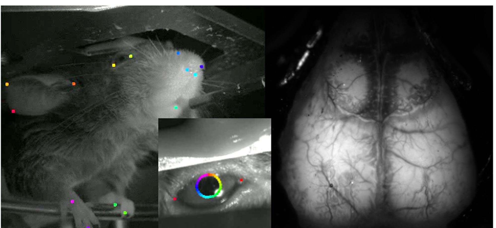
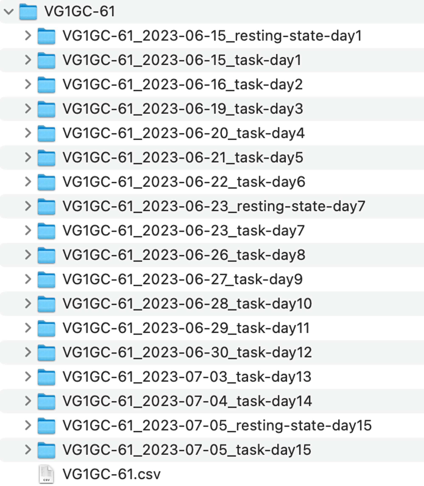
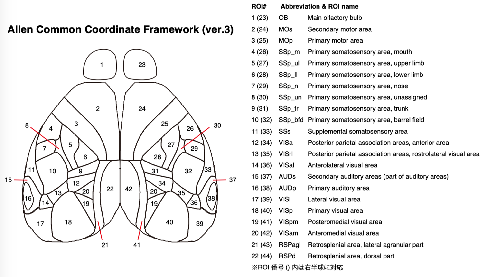
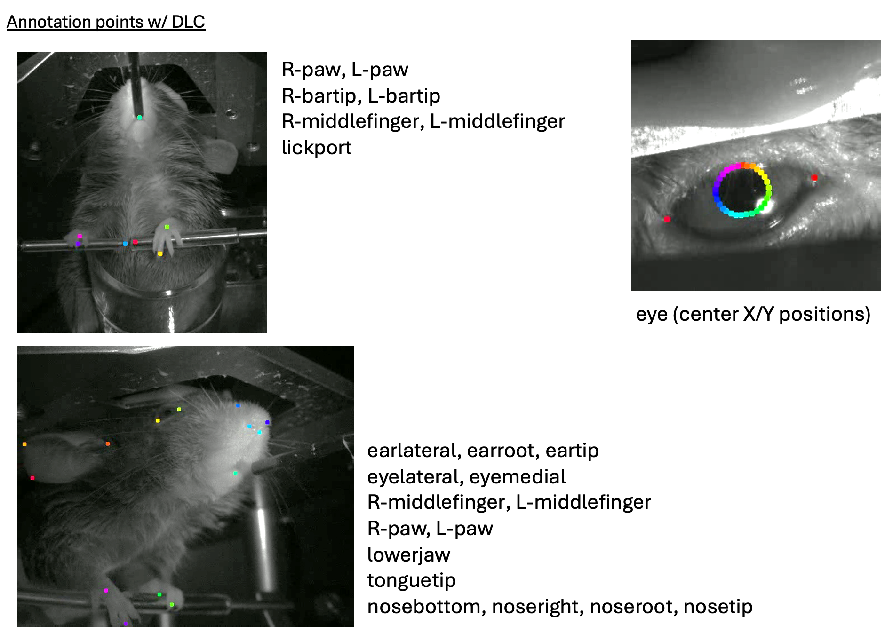

- Animal: Mouse
- Brain regions: Whole Cortex
- Experiments: Body Camera, Face Camera, Wide field 1p
- Task: Learning Process
- Publication date: August 8, 2024
- Authors: Masanori Matsuzaki, Masashi Kondo
- Data size (GB): 800
- Indivisuals: 1
- Session: 15
  
## Abstract

頭部固定マウスにおいて，右前肢で操作可能なレバーを用いたオペラントコンディショニング課題を行った．課題学習中の背側大脳皮質神経活動，上半身・顔・眼球のビデオ記録，および行動・環境センサーの値を15セッション（30min/セッション）にわたって記録した．これに加え，オペラントコンディショニング開始から起算して−1，1,7,15セッション目の行動課題後に，安静時脳活動を記録した（10min/セッション）．オペラントコンディショニング開始から起算して16セッション目には，麻酔下条件で感覚刺激応答を記録した（15min）．本実験において、Ca2+センサーと広視野1光子顕微鏡（Wide-field 1p）により背側大脳皮質全体の神経活動を計測した。さらにマウスの上半身・顔・眼球のビデオ記録ビデオデータ(Body/Face/Eye Camera)を行った。またマウスの行動データとしてレバー位置，舌なめ（licking）に加え，報酬や音刺激提示のタイミングを計測した(Behavior data)。本サンプルデータ公開は，全25個体ぶんのデータ公開に先駆けて1個体の全セッションのデータを①生データ（記録された状態のままのデータ）および②前処理済みデータ（すぐ解析に使用できるよう定型的な処理を施したデータ）の双方を，Creative Commonsライセンスで提供するものである。

【免責】本サンプルデータは，将来予定されている全個体ぶんのデータ公開において予定されているものと同様のデータフォーマットで作成されているが，前処理済みデータについてはクオリティアップのための処理方法の変更などに起因する差異が生じる可能性がある。不明点がある場合は総括班まで連絡してください。

## Sample dataset

### NWB  processed dataset (Recommended)

> 💡 All NWB dataset (46GB): [Dropboxファイル](https://www.dropbox.com/scl/fo/lm6mdu4j7egraynkfir7g/AOchoUWzlYLqsUHJvDOjT5M?rlkey=48nmrnfa0sm8y43w3c172kzcv&dl=0)
>
> Day 1 resting state: [VG1GC-61_2023-06-15_resting-state-day1.nwb](https://www.dropbox.com/scl/fi/4t2liwobfq1uy81sqrmk8/VG1GC-61_2023-06-15_resting-state-day1.nwb?rlkey=gnnytl3lv53xlskr8afa1mo8r&dl=0)
> Day 7 resting state: [VG1GC-61_2023-06-23_resting-state-day7.nwb](https://www.dropbox.com/scl/fi/plsveiru8zniwbok9fz2k/VG1GC-61_2023-06-23_resting-state-day7.nwb?rlkey=7d4s5oojwqur9m4ujugjabd37&dl=0)
> Day 15 resting state: [VG1GC-61_2023-07-05_resting-state-day15.nwb](https://www.dropbox.com/scl/fi/gf8yvxompaeaodecg074u/VG1GC-61_2023-07-05_resting-state-day15.nwb?rlkey=oe3uw8z0n6xenuv2wont3wl8v&dl=0)
> Day 1: [VG1GC-61_2023-06-15_task-day1.nwb](https://www.dropbox.com/scl/fi/3jbphtwfjmcvmwlfeihpk/VG1GC-61_2023-06-15_task-day1.nwb?rlkey=4s991iftx7l4xdrf9f30hfpwf&dl=0)
> Day 2: [VG1GC-61_2023-06-16_task-day2.nwb](https://www.dropbox.com/scl/fi/nqxu9x28jxy0uh04921h7/VG1GC-61_2023-06-16_task-day2.nwb?rlkey=9e4hbwkv6vprdnoahl8mpzy6w&dl=0)
> Day 3: [VG1GC-61_2023-06-19_task-day3.nwb](https://www.dropbox.com/scl/fi/lauidpgvidmowblgshkaj/VG1GC-61_2023-06-19_task-day3.nwb?rlkey=ndxbqsjnmdjapjhl28hmdpska&dl=0)
> Day 4: [VG1GC-61_2023-06-20_task-day4.nwb](https://www.dropbox.com/scl/fi/tkqmf4s9oja8dzubchk0s/VG1GC-61_2023-06-20_task-day4.nwb?rlkey=1et2hsri9ybj516dunwgrta09&dl=0)
> Day 5: [VG1GC-61_2023-06-21_task-day5.nwb](https://www.dropbox.com/scl/fi/rlcxky5yw2ewxo8acyuxs/VG1GC-61_2023-06-21_task-day5.nwb?rlkey=wy9qam4nk0xbdmcv5ks5zn9ac&dl=0)
> Day 6: [VG1GC-61_2023-06-22_task-day6.nwb](https://www.dropbox.com/scl/fi/uzuvb80ie7u31h83xjku0/VG1GC-61_2023-06-22_task-day6.nwb?rlkey=jcphvxi74vwcgm591wi4wm1rq&dl=0)
> Day 7: [VG1GC-61_2023-06-23_task-day7.nwb](https://www.dropbox.com/scl/fi/vmgwj9ermuzj6st0ow4m6/VG1GC-61_2023-06-23_task-day7.nwb?rlkey=bh1psajutux933qclu6cubfq5&dl=0)
> Day 8: [VG1GC-61_2023-06-26_task-day8.nwb](https://www.dropbox.com/scl/fi/shjkpe05fbsfo7nqnhqay/VG1GC-61_2023-06-26_task-day8.nwb?rlkey=ekpuf7sgut3pb3op8wfdx4e3n&dl=0)
> Day 9: [VG1GC-61_2023-06-27_task-day9.nwb](https://www.dropbox.com/scl/fi/ctql6xqveq9si06v8wi6p/VG1GC-61_2023-06-27_task-day9.nwb?rlkey=e0et3m5sq3zwjw04bxr6w1yh8&dl=0)
> Day 10: [VG1GC-61_2023-06-28_task-day10.nwb](https://www.dropbox.com/scl/fi/h4pikm51j0j01clds39ij/VG1GC-61_2023-06-28_task-day10.nwb?rlkey=tq7qdzl92iiede45m98obu4zv&dl=0)
> Day 11: [VG1GC-61_2023-06-29_task-day11.nwb](https://www.dropbox.com/scl/fi/g5m813otmzsomg2iw4l6g/VG1GC-61_2023-06-29_task-day11.nwb?rlkey=tdriw72ng1lj7p4k9tob7imkt&dl=0)
> Day 12: [VG1GC-61_2023-06-30_task-day12.nwb](https://www.dropbox.com/scl/fi/u0qz3ccmgyylyamcrejue/VG1GC-61_2023-06-30_task-day12.nwb?rlkey=vgdc8yvtf2j15meujqne3lhtl&dl=0)
> Day 13: [VG1GC-61_2023-07-03_task-day13.nwb](https://www.dropbox.com/scl/fi/5jf98ru2wo31sf09dc21m/VG1GC-61_2023-07-03_task-day13.nwb?rlkey=etlvad8zd32qvns3pjp8vt0ei&dl=0)
> Day 14: [VG1GC-61_2023-07-04_task-day14.nwb](https://www.dropbox.com/scl/fi/n8qjjsfxqxlb5oge43caq/VG1GC-61_2023-07-04_task-day14.nwb?rlkey=r16rtvtjpnewjwkpawchl9ahe&dl=0)
> Day 15: [VG1GC-61_2023-07-05_task-day15.nwb](https://www.dropbox.com/scl/fi/czgo66wwqd18e4aytc5rq/VG1GC-61_2023-07-05_task-day15.nwb?rlkey=1ao49fbejkpnw4sczys7h7fhx&dl=0)

### All dataset (15 task and 3 resting state of NWB, Wide-field 1 photon images, Face and body movies) 800GB程度

> 💡 https://www.dropbox.com/scl/fo/ve6gu87i28h245af854ho/AAhBEGs2XqYRftr6toEL7Bs?rlkey=fx9gxe89pqx73tedqcg79ydc4&dl=0
> 
> 

データの詳細はData Descriptionを参照のこと。

### Data License

This sample dataset is licensed under a [Creative Commons Attribution 4.0 International License](http://creativecommons.org/licenses/by/4.0/).

## Tutorial

[Python Tutorial: NWBからPeri-Event Time Histogram作成](Python%20Tutorial%20NWB%E3%81%8B%E3%82%89Peri-Event%20Time%20Histogram%E4%BD%9C%E6%88%90%20e5295d783391497896764b190182ef55.md)

[MATLAB Tutorial: NWBからPeri-Event Time Histogram作成](MATLAB%20Tutorial%20NWB%E3%81%8B%E3%82%89Peri-Event%20Time%20Histogram%E4%BD%9C%E6%88%90%2080320cdff81f45ca9ee538b3ac2e571d.md)

## Data description

### File description of sample data

上記で述べた行動課題を15セッション（30min/session），行動課題後の安静時脳活動を4セッション（10min/session），15セッションの行動課題を終えたのちに麻酔下条件での感覚刺激実験を1セッション（15min）行った．本サンプルデータセットでは行動課題15セッション，安静時活動記録4セッションのデータが含まれる．．

各実験条件，セッションごとのデータは生データと前処理済データからなる以下のファイルから構成される．

1 x NWBファイル

2 x TIFFファイル

3 x MP4ファイル

- 生データ
    - imaging（288x288px，緑色光励起および紫色光励起のデータ,tiff形式）
    - videography（face/body/eye，mp4形式）
    - behavior（前処理データを含むnwbファイル内に，behavior_rawとして格納）
- 前処理済みデータ（すべてイメージングにおける各フレームタイミングに同期済み）
    - imaging（AllenCCFによって定義されるROIによって，大まかな領域ごとに区画化された神経活動データ，22 ROIs/hemisphere）
    - estimated positions of body-parts/pupil（3つのビデオデータからDLCによって抽出された体部位，元となるビデオの左上をゼロとするXY座標）
    - behavior

#### **Raw data**

- Neural activity：「imaging」フォルダ内
    - **Blue励起画像：** VG1GC-61_(日付)_(task/resting-state)-day(セッション番号)_B.tif
    - **Violet励起画像：** VG1GC-61_(日付)_(task/resting-state)-day(セッション番号)_V.tif

Ca2+プローブを大脳皮質興奮性細胞に発現するマウスの背側大脳皮質神経活動を広域1光子顕微鏡により撮影した画像データ．実際の計測時には緑色光と紫色光を交互に点灯し，その結果得られるカルシウム依存/非依存的緑色光を60Hzで計測した．このデータは実験後に励起光ごとのフレームに分割され，motion correctionののちspatial downsamplingによって288 x 288ピクセル x （計測時間（s）x30Hz）フレームのtiffデータとして保存されている．

- Videography：「videos」フォルダ内
    - **Body Camera Movie:** *VG1GC-61_(日付)_(task/resting-state)-day(セッション番号)_body.mp4*
    - **Face Camera Movie:** *VG1GC-61_(日付)_(task/resting-state)-day(セッション番号)_face.mp4*
    - **Eye camera movie**:*VG1GC-61_(日付)_(task/resting-state)-day(セッション番号)_eye.mp4*
- マウスの上半身，左側顔面，左眼球をカメラにより100Hzで計測した動画データ。これら3台のビデオカメラはD/Aコンバータから出力されるパルス列（5V，100Hz，デューティ比0.5）によって同期された．同期に用いられたパルス列はアナログデータとして記録されており，行動データおよび神経活動データとの同期に使用できる．
- **Behavior data: NWBファイル内「acquisition」以下に”〜_raw”がついたエントリーに分かれた状態で格納**
    - 記録チャンネル：Lever, Lick, Motion, Pull_dur, Tone, Reward,Temperature, Pressure, Humidity, CO2-level, Over_thr., Task_state, Img, LED_B, LED_V, Video_trig

以下の値が格納されている（HIGH=5V,LOW=0Vを意味する）。

**Lever**: レバー位置（単位mm）．

**Lick**: lickセンサー電圧(単位V)．マウスの舌がスパウトに接触しているときHIGH，していないときLOW．

**Motion:** ボディホルダーに取り付けたロードセル（重さセン

サー）の出力（単位V）．単位重量による校正は実施していないため，重さとしての単位を持たない点に注意．下方に対して変位したとき，その値は基線よりも減少する．

**Pull_dur**: その時点で設定されているTpull（単位ms）．音が提示されてトライアルが始まり，この数値以上の時間レバーを連続して引き続けるとそのトライアルは成功となる．

**Tone**: 音提示装置を駆動するための電圧（単位V）．提示中にHIGH，そうでないときLOW．

**Reward**: 報酬提示装置（マイクロポンプ）を駆動するための電圧（単位V）．提示でHIGH，そうでないときLOW．

**Temperature, Pressure, Humidity, CO2-level**: 統合環境センサーで計測されている温度，気圧，湿度，CO2レベル（単位はそれぞれ℃，hPa，ppm，ppm）．

Over_thr.: タスク制御プログラムにおいてレバー状態監視に用いられている内部変数の値．0のときレバーは引き閾値（1mm）を下回っており，1のときは閾値を超えているとプログラムによって判定されている．

**Task_state**: タスク制御プログラムにおいてトライアル制御に用いられている内部変数の値．0のときITI，1のときレバー引き待ち受け状態（音提示から1s），2のときトライアル成功後の報酬消費時間に対応する．

**Img**: イメージングを行っているカメラから出力される撮影同期用パルス（単位V）．このchのみHIGH＝3.3．撮影したフレームをストレージへ転送するときに出力されているため，実際の撮影が行われているのはこのパルスが立ち上がったときの前である点に注意．また装置の仕様によって，本実験で用いた高速撮影を行う設定では，規定枚数の撮影終了したあとにこのチャンネルからいくつかのパルスが発生してしまうことがある（最大数10パルス程度）．

**LED_B, LED_V**: サンプルの励起に用いている青色および紫色LED光源の制御電圧（単位V）．HIGHのとき点灯，LOWのとき消灯．

**Video_trig**：上半身・顔・眼球を撮影している3台のマシンビジョンカメラの制御信号（単位V）．各パルスの立ち上がりで撮影が行われる（HIGHになっている間に露光が行われている**わけではない**点に注意）．

#### **Processed data（NWB）**

session_description:　セッションの説明

identifier:　セッションの開始日時

timestamps_reference_time：タイムスタンプ情報の基準となる日時

general_ （matlab環境において，このヘッダーを持つ以下のエントリーはすべてメタデータ）

session_id: セッションの識別ID

experimenter：実験者

lab: データ取得を行った研究室

institution: データ取得を行った研究機関

devices：データ取得装置の情報

subject

age: 実験動物の日齢

genotype: 実験動物の遺伝子型

sex: 実験動物の性別

species: 学名

subject_id: 個体識別ＩＤ

weight: 体重

date_of_birth：生年月日

strain: 系統名

acquisition

CO2-level_raw：（上のraw data。説明は重複するの省略、以下同）

Humidity_raw：

Img_raw：

LED-B_raw

LED-V_raw

Lever_raw

Lick_raw

Motion_raw

Over. thr._raw

Pressure_raw

Pull_dur_raw

Reward_raw

Task_state_raw

Temperature_raw

Tone_raw

Video_trig_raw

analysis

atlas_to_data_transform：Allen CCF atlas(512 x 512 pixels, MesoNetのライブラリで使用されているもの)から取得画像(288 x 288 pixels)へ変換するためのアフィン変換行列

processing

behavior

data_interfaces

eye_video_keypoints: 眼球のビデオからDLCによって取得された各部位のデータ（x軸は水平方向に左から右、y軸は垂直方向に上から下）

face_video_keypoints：顔のビデオからDLCによって取得された各部位のデータ

body_video_keypoints：上半身のビデオからDLCによって取得された各部位のデータ

eye_position：瞳孔の中心位置のx/y座標（x軸は水平方向に左から右、y軸は垂直方向に上から下）

pupil_tracking：瞳孔の直径

downsampled

data_interfaces

trials: イメージングに同期するよう調整された試行の情報

Air pressure_ds：イメージングに同期するようダウンサンプルされた気圧レベル『Pressure_raw』（以下同様）

CO2-level_ds: 『CO2-level_raw』

Humidity_ds: 『Humidity_raw』

Lever_ds：『Lever_raw』

LickRate_ds：『Lick_raw』から計算した瞬間lick-rate（単位Hz）をダウンサンプリングしたもの．

Motion_ds：『Motion_raw』

Reward_ds：『Reward_raw』

Room Temp._ds：『Temperature_raw』

State_lever_ds：『Over. thr._raw』

State_task_ds：『Task_state_raw』

Tone_ds：『Tone_raw』

eye_video_keypoints: 『眼球ビデオDLC推定部位』の前処理済みデータ。尤度が低い（0.88より小さい）点、およびその中でx方向/y方向共に中心95パーセントに入っていない点は、ダウンサンプリング前に取り除いて欠損値にした。

face_video_keypoints: 『顔ビデオDLC推定部位』

body_video_keypoints: 『上半身ビデオDLC推定部位』

eye_position：『瞳孔中心位置』

pupil_tracking：『瞳孔直径』

ophys

data_interfaces

DfOverF

roi_response_series

dFF：ヘモダイナミクス補正後の各ROI内の平均シグナル強度

dFF_B：blue channelで取得された各ROI内の平均シグナル強度のΔF/F

dFF_V：UV channelで取得された各ROI内の平均シグナル強度のΔF/F

ImageSegmentation

plane_segmentations

ROIs：各ROIの名前とマスク

ROIs_V：各ROIの名前とマスク

imaging_planes

ImagingPlane_UV：UVチャネルの画像取得に関する情報

ImagingPlane_blue：blueチャネルの画像取得に関する情報

## Methods

### Behavioral task

すべての行動・イメージング実験は防音ボックス内で行われ，ボックス内は暗状態とした．レバーはマウスの尾側方向へ4mm可動し，行動課題においてレバーを引いている状態は1mm以上レバーが引かれている状態として定義した．ひとつのトライアルは音刺激（10kHz純音，70dB  SPL，200ms）の提示から始まり，1s以内にレバーをトライアル成功に必要な時間Tpul以上引き続けることで成功トライアルとなり，報酬として4uLの水がマウスの口の前に設置された呑み口から与えられた．1s以内にレバーを引かなかったトライアル，およびレバーを一度引いたもののそれをTpull以上継続できなったトライアルは失敗トライアルとして判定した．Inter-trial-interval（ITI）はトライアルごとに3−4sの範囲でランダムで決定され，ITI期間中にレバーが引かれた場合はその経過時間がリセットされた．Tpullは直近20トライアルの成功率が80％であった場合に50ms単位で延長され（最小1ms，最大400msまで），一度延長されたらそのセッションにおいてはその後の成功率にかかわらず短縮はされない．あるセッションの終了時におけるTpul_finalとし，その次のセッションにおけるTpullはTpull_final-100msから開始した．

### Acquisition of Wide-field 1 photon image

本実験ではAi162およびVGluT1-Creの2系統の遺伝子改変マウスを交配して得られる個体を使用した．これらの改変遺伝子を両方持つ個体では，大脳皮質興奮性細胞にカルシウムインジケーターであるGCaMP6sが発現する．頭部固定プレートの設置手術と同時に，経頭蓋広域カルシウムイメージングを長期間安定的に行うための処置を行った（Kondo&Matsuzaki, Cell Rep., 2021）．

イメージングごとに励起光が直接マウスの目に入る影響を減らすため，頭部に遮光用シールドを設置してイメージングを行った．時空間解像度は60Hz，588x588ピクセルを使用した．励起光として470nmと405nmのLEDを用い，これらを交互に点灯させて画像取得を行った．405nm励起による画像取得は体動や血流変化を，神経活動に由来するシグナルから除くために行った（後述）．ふたつの励起光を交互に点灯して画像取得を行うため，神経活動の実効サンプリングレートは30Hzである．各LEDの点灯および画像取得タイミングはDAQデバイスを通じて記録されており，励起光ごとのフレーム分離や行動データとの同期に用いることができる．行動課題，安静時活動および感覚刺激実験における合計取得フレーム数はそれぞれ108000（=60x60x30 ），36000（=60x60x10），54000（=60x60x15）枚である．

本実験ではカルシウムセンサーはGCaMP6sを用いており，これは青色光（470nm）で励起されるとカルシウム濃度依存的に緑色光（530nm）の蛍光を発する．一方で紫色光（405nm）で励起されると同様に緑色光の蛍光を発するが，このときの蛍光は細胞内のカルシウム濃度に依存しない．この性質を利用することで広域一光子イメージングにおいて問題になりうる体動や血流量変化によるアーティファクトを一定量補正することができる（Pinto et al., Neuron 2019; Couto et al., Nat. Protocols 2021; Peters et al., Nature 2021）．もしこの青色光励起によって得られた輝度変化データをそのまま用いる場合，その結果は必ずしも神経活動だけによるものではないことに注意が必要である．

### Acquisition of high-speed videography

3台のマシンビジョンカメラを用いて頭部固定マウスの上半身，左顔面，左眼球のビデオ記録を行った．各カメラのサンプリングレートは100Hzで，行動課題の制御・記録を行っているDAQデバイスから出力されるパルス列（5V，100Hz，デューティ比0.5）によって各フレームの取得同期を行った．記録したビデオはmp4形式で保存した．暗室内で撮影を行うため，850nmのLED光源をカメラ後方に設置した．加えて瞳孔経の変動を観察するため，イメージング実施時に約半分程度の開放が得られるよう，マウス正面に設置した910nmLED光源の明るさを調節した．

### Processing of Wide-field 1 photon image

・B/Vスタック分離，揺れ補正，空間ダウンサンプリング

まずはじめに，イメージングによって得られた画像スタックを288x288ピクセルに空間ダウンサンプリングした．これらのイメージング画像は青色および紫色励起光の交互点灯によって得られているため，DAQデバイスで記録されたイメージング画像の取得タイミングと各LEDの点灯タイミングを用いて青色励起による蛍光像と紫色励起による蛍光像に分離した（Img_BおよびImg_V）．その後，体動によるブレを補正するためNoRMCorre（Pnevmatikakis & Giovannucci, Journal of Neuroscience Methods 2017）を使用した．リファレンスにはImg_Bの時間平均画像を用い，Img_Bに含まれる各フレームにおける変位を計算した．その後，求められた変位をImg_BおよびImg_Vの双方に適用した．ここまでの処理が行われたファイルが神経活動イメージングの生データとなる．

・ROIの設定

イメージングデータにおける大脳皮質の領域区分を推定するため、標準脳 (Allen Common Coordinate Framework, Allen CCF) (Wang et al., 2020 Cell) のカルシウムイメージング画像に対するマッピングを以下の手順で行なった。

(i) まず、個体ごとに全セッション平均画像を計算した。各セッションの（揺れ補正後の）平均画像から代表画像をひとつ恣意的に選択し、それ以外の画像をOpenCVのORB特徴量 (Rublee et al., 2011 ICCV)を用いた代表画像とのアラインメントを行ない、各セッション平均から代表画像へのアフィン変換行列を推定した。全セッションについて、それぞれのセッションのシグナル標準偏差画像の代表画像空間への変換を行ない、これらの平均を全セッション平均画像とした。

(ii) 次に、各個体の全セッション平均画像について、MesoNet (Xiao et al., 2019 Nat Commun)で用いられているアルゴリズムの一部を用いて、Allen CCFからのマッピングを行なった。MesoNetで使われている訓練済みニューラルネットワークをそのまま用いて、広域カルシウムイメージング画像における頭蓋のランドマークの推定を行った (Xiao et al., 2019 Nat Commun の Figure 1を参照)。推定されたランドマークを用いて、AllenCCFから全セッション平均画像へのアフィン変換行列を推定した。

(iii) AllenCCFから各セッション平均画像への変換は、上記２種類のアフィン変換行列の合成として計算した。すなわち、(ii) で得られた「Allen CCFから全セッション平均」の変換に、(i) で得られた「各セッション平均から全セッション平均」の変換の逆変換を合成することで、「Allen CCF から各セッション平均」の変換とした。

ROIの設定も、MesoNetで用いられているROIに準拠した。MesoNetで使われているAllen CCF上のROIのマスクに各セッション平均画像へのアフィン変換を行ない、セッションごとのROIとした。それぞれのセッションの各フレームについて、そのフレームでの各ROIのシグナルを、そのROIマスク内の平均シグナルとして計算した。

・hemodynamics補正について

上記の処理によって得られた各ROIの活動について，hemodynamics補正を行った．まず初めに，青励起と紫励起によって得られたそれぞれの画像スタックにおけるROIの輝度変化を，蛍光強度変化率dFF_b=(Fb - Fb_0) / Fb_0およびdFF_v=(Fv - Fv_0) / Fv_0を計算した．各F0には，励起光ごとそれぞれのROIにおける中央値を用いた．次にdFF_vを時間的に2倍のサンプリングレートにアップサンプリングによって60Hzとし，得られた時系列のうち奇数番目のフレームを新たなdFF_vとした（励起が青色-紫色光の順番で行われているため）．dFF_bおよびdFF_vにハイパスフィルター（0.1Hz cutoff)を適用し，時間的に早い変動成分を除くため，dFF_vには移動平均フィルター（13近傍点）を適用した．さらにローパスフィルター（10Hz cutoff）をdFF_bおよびdFF_vに適用し，これらを用いてdFF_vをdFF_bに対して線形近似することでスケーリングファクターaおよびバイアス項bを求めた．これらa.bとdFF_bおよびdFF_vにより，以下の式によって青励起シグナルに混入している可能性がある血流に由来する成分を減算した：dFF_correct =dFF_b - a x dFF_v + b (ここで用いられたdFF_bおよびdFF_vはローパスフィルタを適用する前の時系列)．

### Processing of Face and Body camera image

#### 行動ビデオからのキーポイント推定

ビデオからのキーポイント推定を、DeepLabCut (Mathis et al., 2018 Nat Neurosci; Nath, Mathis et al., 2019 Nat Protocol)を用いて行なった。

X座標が左→右の位置、Y座標が上→下の位置に対応する。

DeepLabCutの性質上、ターゲットとなるキーポイントがビデオ上に存在しなくても位置の推定は行なわれてしまうことに注意が必要である（たとえば舌先のトラッキングは、舌が出ていなくても位置が推定されてしまう）。共有されたデータではこの点を全く考慮せず、キーポイントの有無にかかわらず推定の結果が入力されている。使用の際は、尤度などを用いて事後的にフィルタリングをかける必要がある。（本公開時には推定精度の向上を目指して作業予定である，とか書いておく？）

ダウンサンプリング・前処理済みのデータについては、キーポイントごとに恣意的なフィルタリングをかけた。各キーポイントについてまず適当な閾値をとり、尤度が閾値に満たないデータ点については欠損値とした。さらに残ったデータ点について、x座標、y座標それぞれで中央95パーセントの範囲を計算し、x/y両方の座標がこの範囲に含まれていない場合、やはり欠損値とした。ダウンサンプリングの際は、30 Hzでのイメージングの各フレームの値として、そのフレームの開始時点から次のフレームの開始時点までの時間に存在する全ての（欠損値でない）データ点の平均値を充てた。このような手順を使用している関係上、ダウンサンプリングデータには多くの欠損値が存在することに注意が必要である。

#### 上半身ビデオ

上半身ビデオからは、左右の手に加えて、参照点としてタスク装置の位置（左右のレバー、lick port）を採った：

- leftpaw, rightpaw: 左右の手のひらの中心
- leftmiddlefinger, rightmiddlefinger: 左右の中指の先端
- leftbartip, rightbartip: 左右のレバーの先端
- lickport: lick portの先端

#### 顔ビデオ

顔ビデオからは、動きを捉えたい部位として耳・鼻・左右の前肢・顎・舌にキーポイントをとった。このほか参照点になりうる部位として、耳の根元・鼻の根元・目をキーポイントとした：

- earroot: 右側の外耳の根元、最も前背側の端点
- earlateral: 右側の外耳の縁の中で、腹側と外側の中間の点
- eartip: 右側の外耳の、最も外側の点
- noseroot: 正中線上、鼻の根元
- nosebottom: 正中線上、鼻の最も腹側の点
- noseright: 右鼻孔の壁の最も外側の点
- nosetip: 正中線上、鼻の頭
- leftpaw, rightpaw: 左右の手のひらの中心
- leftmiddlefinger, rightmiddlefinger: 左右の中指の先端
- lowerjaw: 正中線上、下顎の先端
- tonguetip: 正中線上、舌先（DeepLabCutの性質上、舌が出ていなくてもキーポイントは推定されてしまうことに注意：尤度などを用いた事後的なフィルタリングが必要）
- eyemedial: 右目頭
- eyelateral: 右目尻

#### 右目ビデオ

右目ビデオでは、瞳孔のトラッキングを主目的として、瞳孔の縁にキーポイントをとった：

- pupiledge01—pupiledge30: 瞳孔の縁
- lateralcorner: 右目尻
- medialcorner: 右目頭

#### 瞳孔の推定

右目ビデオのキーポイントを利用して、瞳孔の位置・大きさの推定を行なった。100 Hzの各ビデオフレームについて、瞳孔の縁にとったキーポイントに楕円をフィッティングし、その中心を「目の位置」、長軸の長さを「瞳孔径」と定義した。