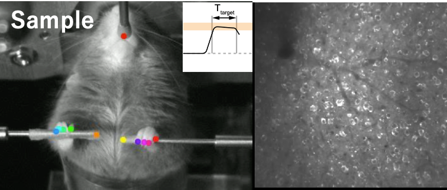
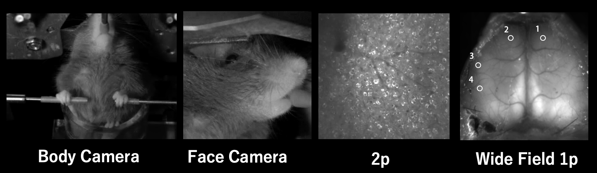
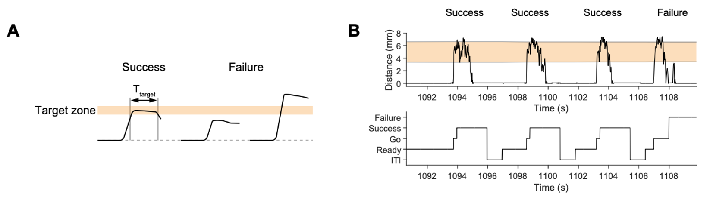
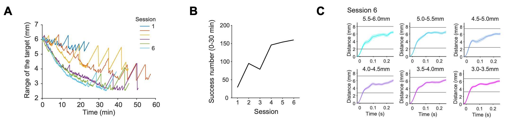
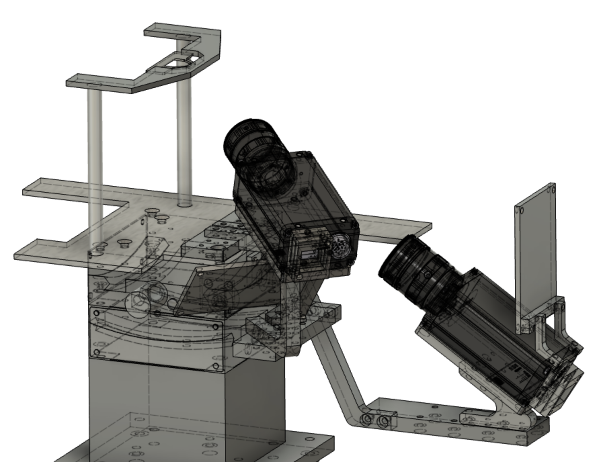
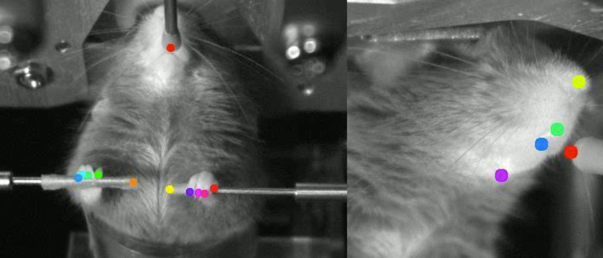

- Animal: Mouse
- Brain regions: Whole Cortex
- Experiments: 2p, Body Camera, Face Camera, Lever-pull, Wide field 1p
- Task: Target zone lever-pull
- Publication date: August 25, 2022
- Authors: Masanori Matsuzaki, Shin-Ichiro Terada
- Data size (GB): 70
- Indivisuals: 2
- Session: 2

## Abstract

In this sample data, we present one session each of wide-area one-photon calcium imaging of the dorsal cortex of mice performing a motor task that is rewarded by holding a lever to an adaptively variable range, and two-photon calcium imaging of layer 2/3 (L2/3) and layer 5 (L5) of the forelimb-related dorsal motor area (here simply M1).

## Sample dataset

### Download

**Raw data**

> 💡 2p image data (30Hz): https://drive.google.com/drive/folders/10A9M7ybWxFTpcy2qbXc1XRIrdGzk0cTe?usp=sharing
> Face Camera movie (70Hz): https://drive.google.com/file/d/1TVjdUv_HEAbZsRXF5f2LSa8ZbXyZOrhE/view?usp=sharing
> Body Camera movie (70Hz): https://drive.google.com/file/d/13jNFF4K_2KyAqokdoqqKzQcx22nyeZ6U/view?usp=sharing
> Behavior data (5kHz): https://drive.google.com/file/d/1Y_RocHZKpDvr6-lD-reKM6BtJTX90Laa/view?usp=sharing

> 💡 Wide Field 1p image data(30Hz): https://drive.google.com/drive/folders/1Cm9xSXFSjCiTdy8EPsWv26kyu-igJSlF?usp=sharing
> Face Camera data (70Hz): https://drive.google.com/file/d/1HJsX2dRqZix-tY66S4SRmPBuwiyTbOki/view?usp=sharing
> Body Camera data (5kHz): https://drive.google.com/file/d/1YSOj7o7yXGLFi3H8Snx9e0Um9eA2L6G4/view?usp=sharing
> Behavior data (5kHz): https://drive.google.com/file/d/1zHu86snLE1W7DfJVUpwPBHTcfRV4GrEB/view?usp=sharing

**Processed data**

> 💡 2p Image data: https://drive.google.com/file/d/1LYKhpiHKRkf4ctbX-E6KkJzrqoCW7HIF/view?usp=sharing
> DF/F image data: https://drive.google.com/file/d/1qcvmk5QZzR8OFlfTbZklD0_uSX4Rxzmn/view?usp=sharing
> Task data: https://drive.google.com/file/d/1iOfElA36bNnpvsDXoStG9gI66M8VgBdH/view?usp=sharing
> Face camera data: https://drive.google.com/file/d/1tI6EHkVIlg76r0fuP--jdYw81V_m3YhI/view?usp=sharing
> Body camera data: https://drive.google.com/file/d/1bzwbtTvBNvLCFViu9c5Zjc8Tc6QjjJBp/view?usp=sharing

> 💡 Wide field 1p data: https://drive.google.com/file/d/1-EpWoVFmI_BoasCdHjzZbW5yPD27r9AD/view?usp=sharing
> DF/F image data: https://drive.google.com/file/d/1LYl8ymyAyMENt6GXPtXUP6TxdGPVrvgm/view?usp=sharing
> Task data: https://drive.google.com/file/d/1tKni4HwUdTTwgFJ0NPuiDLH0cjPRgKAL/view?usp=sharing
> Face camera data: https://drive.google.com/file/d/1NiBDScizLNlBGhECHDaBcsyAcaAMEiOz/view?usp=sharing
> Body camera data: https://drive.google.com/file/d/187IwggB6xJFRoeenZzrNtEf6VCsp20et/view?usp=sharing

**Analyzed data**

> 💡 2p image dataset (30Hz): https://drive.google.com/file/d/1xF7RruKCwyzSe53_oKBMLn74fMD4TVvE/view?usp=sharing

> 💡 Wide field 1p image dataset (30Hz): https://drive.google.com/file/d/1rsTi9U3BGOroGJcP1tGCnHFJfC3r07UR/view?usp=sharing

### Data License

This sample dataset is licensed under a [Creative Commons Attribution 4.0 International License](http://creativecommons.org/licenses/by/4.0/).

### Term of Use

Please cite: S. Terada, K. Nakae, M. Matsuzaki. (2022). Motor learning of lever pull task in BraiDyn-BC Database. The doi link will be added in future. 

## Data Description

### File description of sample data

#### Raw data

- **Body Camera Movie: RS_Front_21070707(date) jRG10(individual number).mp4**
Movie data of the ventral side of a mouse measured by a camera at 70 Hz. Note that the start timing of the movie is different from that of the imaging.
- **Face Camera Movie: RS_Side_21070707(date) jRG10(individual number).mp4**
Movie data of the right side face of a mouse measured by a camera at 70Hz. Note that the start timing of the image is different from that of the imaging data.
- **2p/1p image data: .oir (Olympus binary format) and .sifx (Andor binary format**)
Pre-processed image data for two-photon and one-photon imaging, 512 x 512 pixel, acquisition frame rate 30 Hz. oir2stdData([https://github.com/YR-T/oir2stdData/](https:// [github.com/YR-T/oir2stdData/blob/master/README.md](http://github.com/YR-T/oir2stdData/blob/master/README.md))) for 2p imaging and lvm-file-import(https://jp.mathworks.com/matlabcentral/ fileexchange/19913-lvm-file-import) can be read using MATALB. MATALB can be used to read the file. In the directory, "XXX.oir" or "Spooled files.sifx" is the file to be read, and the rest of the files are binary files that are referenced as needed when reading.
- **Behavior data: 210707(date) jRG10(individual number) nanataki 5000Hz(sampling rate).lvm**
Behavior data and frame signals for synchronization of lever trajectories and task status measured at 5000 Hz. https://jp.mathworks.com/matlabcentral/fileexchange/19913-lvm-file-import
Segment1.data is a matrix where the rows are the number of frames and the columns are the recording channels, and the following values are stored (HIGH=5V, LOW=0V is meant).
**ch.1**: lever orbit (unit: mm)
**ch.2**: Not used
**ch.3**: Imaging frame; LOW to HIGH for 2p, HIGH to LOW for 1p to start frame acquisition.
**Ch.4**: Body motion video frame; LOW to HIGH to start acquiring frames; Body and Face Camera are synchronized; LOW to HIGH to start acquiring frames at 1p; HIGH to LOW at 1p.
**1: Lever is below Base threshold, 2: Lever is above Base threshold but outside Target zone, 3: Lever is inside Target zone (see Result and Method for details of each lever position).
**ch.6**: Task State: 0 or 1: ITI, 2: Ready, 3: Go, 4: Success, 5: Failure (see Result and Method for details of each state)
**ch.7**: Upper limit of Target zone
**ch.8**: Lower limit of Target zone

#### Preprocessed data

- **21070707(date)-jRG10(individual number)-M1(imaging area)-z140um(depth from brain surface of imaging)_normcorre.mat (2p) or 210707(individual number)-jRG12(individual number)_image.mat**
    
    **In case of 2p**: After reading raw data, use NoRMCorre([https://github.com/flatironinstitute/NoRMCorre](https://github.com/flatironinstitute/NoRMCorre The image data is stored as a 4d-matrix of X x Y x Z x T under stdData.image.
    **1p case**: raw data read and resized to 128 x 128 pixel, stored as X x Y x T 3d-matrix under stdData.I.
    
- **CNMF result (2p): 210707(date)-jRG10(individual number)-M1(imaging area)-z140um(depth from brain surface of imaging)_CNMF.mat**
The results of ROI detection using CNMF(https://github.com/flatironinstitute/CaImAn-MATLAB) are stored. A,C,S,P,b,f: CNMF output results under stdData.cNMF ([https://github.com/flatironinstitute/CaImAn-MATLAB/wiki/Interpreting-Results](https ://github.com/flatironinstitute/CaImAn-MATLAB/wiki/Interpreting-Results)). Since the AR model is estimated with p=0, the following F_dcv is used when dealing with data after deconvolution F,F_bcsub,F_bcsub,F_bcsub
F,F_bcsub,F0,F_dff,F_dcv,F_denoise: The luminance change of each cell (F,F_bcsub,F0,F_dff), re-extracted using the ROI and background information determined by CNMF and the constrained AR-2 OASIS algorithm (Friedrich, J., Zhou, P., and Paninski, L. (2017). Fast online deconvolution of calcium imaging data. PLoS Comput. Biol. 13, e1005423.) were used to individually estimate the decay time constant and deconvolved estimates (F_dcv,F_ denoise).
- **ΔF/F Postprocessed image [1p]: dated 210707)-jRG12(individual number)_dFF.mat**
Image file in which ΔF/F=(F-F0)/F0 is calculated for each pixel of the Preprocessed image, where F0 is the value of the 8th percentile at each time ±30sec. It is stored under stdData.I_dff as a 3d-matrix of X x Y x T.
- **Behavior data: 210707(date)-jRG10(individual number)-M1(imaging area)-z140um_task(depth from brain surface of imaging).mat**
task(structure)
Fs: sampling rate
lever: Lever trajectory (unit: mm)
lever_state: Lever State. 1: lever is below Base threshold, 2: lever is above Base threshold but outside Target zone, 3: lever is inside Target zone (See Result and Method for details of each lever position. )
task_state: Task State. 1: ITI, 2: Ready, 3: Go, 4: Success, 5: Failure (see Result and Method for details on each state)
bottom: Lower limit of Target zone
top: Upper limit of target zone
frame_trig: Start timing of each frame of imaging
video_trig: Start of each frame of the body movement video
- **DeepLabCut(Body): RS_Front_21070707(date) jRG12(individual number)DeepCut_resnet50_RS_Front_ForelimbsDec30shuffle1_500000.csv**
Output file after DeepLabCut(https://github.com/DeepLabCut/DeepLabCut) is executed on the body camera The estimated position (X,Y) and likelihood for each tracking point are stored.
spout': Spout tip
lever_tip': lever tip
'armrest_tip': Tip of the armrest where the left hand is placed
thumb_r':Right thumb
index_r':index finger of the right hand
middle_r':Middle finger of right hand
ring_r':ring finger of right hand
pinky_r':right hand thumb
thumb_l':left thumb
index_l':left index finger
middle_l':Left hand middle finger
ring_l':ring finger of left hand
pinky_l':left thumb
- **DeepLabCut(Face): RS_Side_21070707(date) jRG12(individual number)DeepCut_resnet50_RS_Side_FaceDec28shuffle1_300000.csv**
Output file after DeepLabCut(https://github.com/DeepLabCut/DeepLabCut) is executed on the face camera. The estimated position (X,Y) and likelihood are stored for each tracking point.
spout_side': Spout tip
tip_of_nose': tip of nose
'philtrum':upper_lip(middle_of_person)
lower_lip':lower lip
jaw':chin
tongue':tip of tongue

#### Analyzed (data after synchronous processing for analysis).

- *stdData(structure): [2p] 210708(date)-jRG10(individual number)-M1(imaging area)-z512um(depth from brain surface of imaging)_stdData.mat or [1p] 210707(date)-jRG12(individual number)*stdData.mat **
I: imaging data averaged over all time
I_dff[1p]: Image after ΔF/F processing (same as the one created in Preprocessed)
rs_task(structure): Behavior data synchronized with the imaging frame rate (30Hz)
lever: Lever orbit (unit: mm)
lever_state: Lever State. 1: lever is below Base threshold, 2: lever is above Base threshold but outside Target zone, 3: lever is inside Target zone (see Result and Method for details of each lever position. )
task_state: Task State. 1: ITI, 2: Ready, 3: Go, 4: Success, 5: Failure (see Result and Method for details on each state)
bottom: Lower limit of Target zone
top: Upper limit of Target zone
rs_motions(structure): DeepLabCut output data synchronized with the imaging frame rate (30Hz)
spout': Spout tip (Body camera reference)
lever_tip': Lever tip
'armrest_tip': Tip of the armrest on which the left hand is placed
thumb_r':Right thumb
index_r':index finger of the right hand
middle_r':Middle finger of right hand
ring_r':ring finger of right hand
pinky_r':right hand thumb
thumb_l':left thumb
index_l':left index finger
middle_l':Left hand middle finger
ring_l':ring finger of left hand
pinky_l':left thumb
spout_side':Spout tip (Face camera reference)
tip_of_nose':tip of nose
'philtrum': Upper lip (mid-lip)
lower_lip': Lower lip
jaw':chin
tongue':tip of tongue
cNMF (structure): Result of performing ROI detection using CNMF (same as created in Preprocessed).
A,C,S,P,b,f: CNMF output results ([https://github.com/flatironinstitute/CaImAn-MATLAB/wiki/Interpreting-Results](https://github.com/flatironinstitute/CaImAn-MATLAB/wiki/Interpreting-Results)). since the AR model is estimated with p=0, the following F_dcv is used to handle data after deconvolution.
F,F_bcsub,F0,F_dff,F_dcv,F_denoise: the luminance change of each cell (F,F_bcsub,F0,F_dff), again extracted using the ROI and background information determined by CNMF, and the constrained AR-2 OASIS algorithm (Friedrich, J., Zhou, P., and Paninski, L. (2017). Fast online deconvolution of calcium imaging data. PLoS Comput. Biol. 13, e1005423.), with individual estimates of decay time constant and deconvolution estimates (F_dcv,F* denoise).

## Result

### Task

The objective of this task is to learn the action of holding the lever continuously within a set target zone for a fixed time (T_target) (A). The task is in the form of a spontaneously initiated task. The task progresses as follows by transitioning between task states (B).

The task state transitions from "ITI" to "Ready" by holding the lever below the base threshold set at 0.5 mm for at least 1 second. If the lever exceeds the basal threshold during the "Ready" period, the Task state moves to "Go" and the trial begins, giving the mouse a reaction period of 1000 ms. During this period, if the lever is continuously in the target zone for T_target (200 ms), the trial is considered successful and a reward (4 µl of water) is given immediately even during the reaction period, and the Task state moves to "Success". On the other hand, if the task is not successful within the reaction period, the task state will be changed to "Failure". The target zone is adaptive from the start of the session to the success of the session. The range decreases according to the formula ±3k^n (k=0.995; n=number of successes). To maintain individual motivation, the range was set to increase with the time of the last success (T_lr[sec]) according to the formula T_lr0.004. To provide sensory feedback to the individual on the extent of the target zone, a 10 kHz pure tone was presented while the lever was within the target zone during the "Go" period.

#### Learning process of Task

The learning of the task generally progressed as follows (the data below are different from the individuals in the sample data, and the Target zone was set to start at 5 ± 3 mm). Training was initiated after 2 days of water withdrawal restriction (Terada et al., Nat. Commun., 2018). (A) shows the evolution of Target zones within each session from Session 1 to 6 in one individual; as the sessions progressed, learning progressed to succeed in narrower target zones, and the number of successes increased accordingly (B). (C) shows the average trajectory of the lever at Session 6, with the "go" period transition point as 0, for the width of the target zone indicated at the top of each figure. As the learning progresses, the lever trajectory moves around the center of the target zone regardless of the range of the target zone.

#### Imaging

One- or two-photon imaging was performed in mice that had completed after 6 session of the tasks. Mice were Thy1-jRGECO1a transgenic mice, and individuals undergoing one-photon imaging were treated with skull transparency enhancement followed by wide-area one-photon calcium imaging of the dorsal cerebral cortex using macrofluorescence microscopy (Kondo et al, Cell. Rep., 2021) was performed. For individuals undergoing two-photon imaging, two-photon calcium imaging (Terada et al., Nat. Commun., 2018) was performed after installation of a glass window.

## Method

### Setting of Face and Body cameras

The Body and Face cameras were positioned so that the position from the head fixing plate to the imaging surface was approximately [Body] X=6, Y=165, Z=-120 (mm) and [Face] X=40, Y=102, Z=-40 (mm) when X, Y, and Z are the front-back, left-right, and top-bottom positions from the mouse, respectively. The resolution of each camera is approximately The resolution of each camera is approximately 0.186 mm/pix for [Body] and 0.105 mm/pix for [Face]. The cameras were positioned as defined by the following 3D model.

### Processing of Face and Body camera image

DeepLabCut was used to track markers in the following areas. For more information, see Data desciription.

### Processing of 2p image data

The analysis was performed using MATLAB (2020a; Mathworks, Natick, MA, USA). Lateral displacements of the acquired image sequences were corrected using the NoRMCorre algorithm (Pnevmatikakis and Giovannucci, 2017). The image after the aforementioned processing is treated as I_raw below. After motion correction, the region of interest (ROI) was determined using the CNMF algorithm (Pnevmatikakis et al., 2016). This algorithm decomposes I_raw into the temporal component of neural activity, its spatial component (ROI), and the background (I_back). After identifying these components, the background signal-removed luminance (F_bcsub) of each ROI was determined by multiplying the estimated spatial components in the background-subtracted raw image (Iraw - Iback). The detrended trend luminance change (ΔF/F; F_dff) was then calculated with the 8th percentile value at each time point ±30 seconds as F0. The ΔF/F for each ROI was estimated by individually estimating the decay time constant using the constrained AR-2 OASIS algorithm (Friedrich et al., PLoS Comput. Biol., 2017) and deconvolving the estimated values (F_dcv,F_dff). dcv,F_denoise) were obtained.

## Reference

Terada, S. I., Kobayashi, K., Ohkura, M., Nakai, J., & Matsuzaki, M. (2018). Super-wide-field two-photon imaging with a micro-optical device moving in post-objective space. *Nature communications*, *9* (1), 1-14.