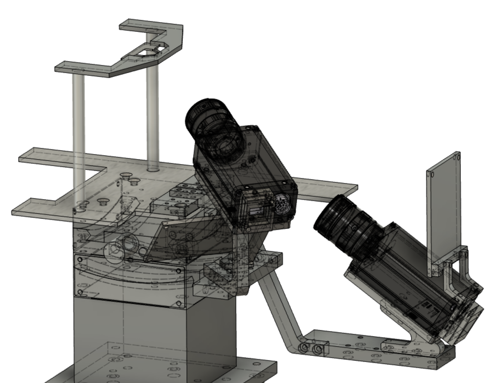

- Animal: Mouse
- Brain regions: Whole Cortex
- Experiments: 2p, Body Camera, Face Camera, Lever-pull, Wide field 1p
- Task: Target zone lever-pull
- Publication date: August 25, 2022
- Authors: Masanori Matsuzaki, Shin-Ichiro Terada
- Data size (GB): 70
- Indivisuals: 2
- Session: 2

## Abstract

本サンプルデータでは、レバーを適応的に変化する範囲内へと保持することで報酬が得られる運動課題を遂行しているマウスの背側大脳皮質の広域１光子カルシウムイメージング、および前肢関連背側運動領域(以下単純にM1)の第2/3層(L2/3)および第5層(L5)の２光子カルシウムイメージングのデータを各１セッションずつ公開している。

## Sample dataset

### Download

**Raw data**

> 💡 2p image data (30Hz): [https://drive.google.com/drive/folders/10A9M7ybWxFTpcy2qbXc1XRIrdGzk0cTe?usp=sharing](https://drive.google.com/drive/folders/10A9M7ybWxFTpcy2qbXc1XRIrdGzk0cTe?usp=sharing)
> Face Camera movie (70Hz): [https://drive.google.com/file/d/1TVjdUv_HEAbZsRXF5f2LSa8ZbXyZOrhE/view?usp=sharing](https://drive.google.com/file/d/1TVjdUv_HEAbZsRXF5f2LSa8ZbXyZOrhE/view?usp=sharing)
> Body Camera movie (70Hz): [https://drive.google.com/file/d/13jNFF4K_2KyAqokdoqqKzQcx22nyeZ6U/view?usp=sharing](https://drive.google.com/file/d/13jNFF4K_2KyAqokdoqqKzQcx22nyeZ6U/view?usp=sharing)
> Behavior data (5kHz): [https://drive.google.com/file/d/1Y_RocHZKpDvr6-lD-reKM6BtJTX90Laa/view?usp=sharing](https://drive.google.com/file/d/1Y_RocHZKpDvr6-lD-reKM6BtJTX90Laa/view?usp=sharing)

> 💡 Wide Field 1p image data(30Hz): [https://drive.google.com/drive/folders/1Cm9xSXFSjCiTdy8EPsWv26kyu-igJSlF?usp=sharing](https://drive.google.com/drive/folders/1Cm9xSXFSjCiTdy8EPsWv26kyu-igJSlF?usp=sharing)
> Face Camera data (70Hz): [https://drive.google.com/file/d/1HJsX2dRqZix-tY66S4SRmPBuwiyTbOki/view?usp=sharing](https://drive.google.com/file/d/1HJsX2dRqZix-tY66S4SRmPBuwiyTbOki/view?usp=sharing)
> Body Camera data (5kHz): [https://drive.google.com/file/d/1YSOj7o7yXGLFi3H8Snx9e0Um9eA2L6G4/view?usp=sharing](https://drive.google.com/file/d/1YSOj7o7yXGLFi3H8Snx9e0Um9eA2L6G4/view?usp=sharing)
> Behavior data (5kHz): [https://drive.google.com/file/d/1zHu86snLE1W7DfJVUpwPBHTcfRV4GrEB/view?usp=sharing](https://drive.google.com/file/d/1zHu86snLE1W7DfJVUpwPBHTcfRV4GrEB/view?usp=sharing)

**Processed data**

> 💡 2p Image data: [https://drive.google.com/file/d/1LYKhpiHKRkf4ctbX-E6KkJzrqoCW7HIF/view?usp=sharing](https://drive.google.com/file/d/1LYKhpiHKRkf4ctbX-E6KkJzrqoCW7HIF/view?usp=sharing)
> DF/F image data: [https://drive.google.com/file/d/1qcvmk5QZzR8OFlfTbZklD0_uSX4Rxzmn/view?usp=sharing](https://drive.google.com/file/d/1qcvmk5QZzR8OFlfTbZklD0_uSX4Rxzmn/view?usp=sharing)
> Task data: [https://drive.google.com/file/d/1iOfElA36bNnpvsDXoStG9gI66M8VgBdH/view?usp=sharing](https://drive.google.com/file/d/1iOfElA36bNnpvsDXoStG9gI66M8VgBdH/view?usp=sharing)
> Face camera data: [https://drive.google.com/file/d/1tI6EHkVIlg76r0fuP--jdYw81V_m3YhI/view?usp=sharing](https://drive.google.com/file/d/1tI6EHkVIlg76r0fuP--jdYw81V_m3YhI/view?usp=sharing)
> Body camera data: [https://drive.google.com/file/d/1bzwbtTvBNvLCFViu9c5Zjc8Tc6QjjJBp/view?usp=sharing](https://drive.google.com/file/d/1bzwbtTvBNvLCFViu9c5Zjc8Tc6QjjJBp/view?usp=sharing)

> 💡 Wide field 1p data: [https://drive.google.com/file/d/1-EpWoVFmI_BoasCdHjzZbW5yPD27r9AD/view?usp=sharing](https://drive.google.com/file/d/1-EpWoVFmI_BoasCdHjzZbW5yPD27r9AD/view?usp=sharing)
> DF/F image data: [https://drive.google.com/file/d/1LYl8ymyAyMENt6GXPtXUP6TxdGPVrvgm/view?usp=sharing](https://drive.google.com/file/d/1LYl8ymyAyMENt6GXPtXUP6TxdGPVrvgm/view?usp=sharing)
> Task data: [https://drive.google.com/file/d/1tKni4HwUdTTwgFJ0NPuiDLH0cjPRgKAL/view?usp=sharing](https://drive.google.com/file/d/1tKni4HwUdTTwgFJ0NPuiDLH0cjPRgKAL/view?usp=sharing)
> Face camera data: [https://drive.google.com/file/d/1NiBDScizLNlBGhECHDaBcsyAcaAMEiOz/view?usp=sharing](https://drive.google.com/file/d/1NiBDScizLNlBGhECHDaBcsyAcaAMEiOz/view?usp=sharing)
> Body camera data: [https://drive.google.com/file/d/187IwggB6xJFRoeenZzrNtEf6VCsp20et/view?usp=sharing](https://drive.google.com/file/d/187IwggB6xJFRoeenZzrNtEf6VCsp20et/view?usp=sharing)

**Analyzed data**

> 💡 2p image dataset (30Hz): [https://drive.google.com/file/d/1xF7RruKCwyzSe53_oKBMLn74fMD4TVvE/view?usp=sharing](https://drive.google.com/file/d/1xF7RruKCwyzSe53_oKBMLn74fMD4TVvE/view?usp=sharing)

> 💡 Wide field 1p image dataset (30Hz): [https://drive.google.com/file/d/1rsTi9U3BGOroGJcP1tGCnHFJfC3r07UR/view?usp=sharing](https://drive.google.com/file/d/1rsTi9U3BGOroGJcP1tGCnHFJfC3r07UR/view?usp=sharing)

### Data License

This sample dataset is licensed under a [Creative Commons Attribution 4.0 International License](http://creativecommons.org/licenses/by/4.0/).

### Term of Use

Please cite: S. Terada, K. Nakae, M. Matsuzaki. (2022). Motor learning of lever pull task in BraiDyn-BC Database. The doi link will be added in future. 

## Data Description

### File description of sample data

#### Raw data

- **Body Camera Movie: RS_Front_210707(日付) jRG10(個体番号).mp4**
マウスの腹側をカメラにより70Hzで計測した動画データ。撮影の開始タイミングはイメージングとは異なっている点に注意。
- **Face Camera Movie: RS_Side_210707(日付) jRG10(個体番号).mp4**
マウスの右側面顔をカメラにより70Hzで計測した動画データ。撮影の開始タイミングはイメージングとは異なっている点に注意。
- **2p/1p image data:  .oir (Olympus binary format) and .sifx (Andor binary format**
2光子および1光子イメージングの加工前画像データ。512 x 512 pixel。取得フレームレートは30Hz。2pイメージングについてはoir2stdData([https://github.com/YR-T/oir2stdData/](https://github.com/YR-T/oir2stdData/blob/master/README.md))、1pイメージングについてはlvm-file-import([https://jp.mathworks.com/matlabcentral/fileexchange/19913-lvm-file-import](https://jp.mathworks.com/matlabcentral/fileexchange/19913-lvm-file-import))をMATALB用いて読み込むことができる。ディレクトリにおいて、"XXX.oir" or Spooled files.sifx"が読み込みの対象とするファイルであり、残りのファイルは読み込み時に随時参照されるバイナリーファイルである。
- **Behavior data: 210707(日付) jRG10(個体番号) nanataki 5000Hz(サンプリングレート).lvm**
レバー軌道や課題の状況を5000Hzで計測した行動データおよび同期用のフレーム信号。MATLABで読み込むためには、以下を利用のこと。[https://jp.mathworks.com/matlabcentral/fileexchange/19913-lvm-file-import](https://jp.mathworks.com/matlabcentral/fileexchange/19913-lvm-file-import)
Segment1.dataは行がフレーム数，列が記録チャンネルの行列になっており、以下の値が格納されている（HIGH=5V,LOW=0Vを意味する）。
**ch.1**：レバー軌道（unit: mm）
**ch.2**：未使用
**ch.3**：イメージングフレーム。2pではLOW to HIGH、1pではHIGH to LOWでフレーム取得開始。
**ch.4**：体動計測ビデオフレーム。LOW to HIGHでフレーム取得開始。BodyおよびFace Cameraは同期している。
**ch.5**：Lever State。1: レバーが Base threshold 以下, 2: レバーがBase threshold 以上かつTarget zone外, 3: レバーがTarget zone内  (各レバー位置の詳細についてはResultおよびMethodを参照)
**ch.6**：Task State。0 or 1: ITI, 2: Ready, 3: Go, 4: Success, 5: Failure (各ステートの詳細についてはResultおよびMethodを参照)
**ch.7**：Target zoneの上限
**ch.8**：Target zoneの下限

#### Preprocessed data

- **210707(日付)-jRG10(個体番号)-M1(イメージング領域)-z140um(イメージングの脳表からの深さ)_normcorre.mat (2p) or 210707(個体番号)-jRG12(個体番号)_image.mat**
    
    **2pの場合**： rawデータ読み込み後、NoRMCorre([https://github.com/flatironinstitute/NoRMCorre](https://github.com/flatironinstitute/NoRMCorre))を用いてnon-rigid motion correctionを行ったimagign data. stdData.image以下に X x Y x Z x Tの4d-matrixとして格納されている。
    **1pの場合**： rawデータ読み込み後、128 x 128 pixelにリサイズを行ったもの。stdData.I以下に X x Y x Tの3d-matrixとして格納されている。
    
- **CNMF result (2p): 210707(日付)-jRG10(個体番号)-M1(イメージング領域)-z140um(イメージングの脳表からの深さ)_CNMF.mat**
CNMF([https://github.com/flatironinstitute/CaImAn-MATLAB](https://github.com/flatironinstitute/CaImAn-MATLAB))を用いてROI検出を実行した結果を格納している。stdData.cNMF以下にA,C,S,P,b,f: CNMFの出力結果 ([https://github.com/flatironinstitute/CaImAn-MATLAB/wiki/Interpreting-Results](https://github.com/flatironinstitute/CaImAn-MATLAB/wiki/Interpreting-Results))。ARモデルをp=0として推定を行っているため、deconvolution後のデータを扱う場合は以下のF_dcvを用いる。
F,F_bcsub,F0,F_dff,F_dcv,F_denoise: CNMFで決定されたROIおよびバックグラウンド情報を用いて再度抽出した各細胞の輝度変化(F,F_bcsub,F0,F_dff)、およびconstrained AR-2 OASIS algorithm (Friedrich, J., Zhou, P., and Paninski, L. (2017). Fast online deconvolution of calcium imaging data. PLoS Comput. Biol. 13, e1005423.)を用いて個別にdecay time constantの推定を行いデコンボリューションを行った推定値(F_dcv,F_denoise)である。
- **ΔF/F処理後画像[1p]: 210707日付)-jRG12(個体番号)_dFF.mat**
Preprocessed imageの各ピクセルに対し、各時間±30secにおける8パーセンタイルの値をF0とし、ΔF/F=(F-F0)/F0を計算した画像ファイル。stdData.I_dff以下に X x Y x Tの3d-matrixとして格納されている。
- **Behavior data: 210707(日付)-jRG10(個体番号)-M1(イメージング領域)-z140um_task(イメージングの脳表からの深さ).mat**
task(構造体)
Fs: サンプリングレート
lever: レバー軌道(unit: mm)
lever_state: Lever State。1: レバーが Base threshold 以下, 2: レバーがBase threshold 以上かつTarget zone外, 3: レバーがTarget zone内  (各レバー位置の詳細についてはResultおよびMethodを参照)
task_state: Task State。1: ITI, 2: Ready, 3: Go, 4: Success, 5: Failure (各ステートの詳細についてはResultおよびMethodを参照)
bottom: Target zoneの下限
top: Target zoneの上限
frame_trig: イメージングの各フレームの開始タイミング
video_trig: 体動計測ビデオの各フレームの開始タイミング
- **DeepLabCut(Body): RS_Front_210707(日付) jRG12(個体番号)DeepCut_resnet50_RS_Front_ForelimbsDec30shuffle1_500000.csv**
Body cameraに対しDeepLabCut([https://github.com/DeepLabCut/DeepLabCut](https://github.com/DeepLabCut/DeepLabCut))を実行した後の出力ファイル下記に示す各トラッキングポイントについての推定位置(X,Y)および尤度(likelihood)について格納されている。
'spout':スパウトの先端
'lever_tip':レバーの先端
'armrest_tip':左手を置くアームレストの先端
'thumb_r':右手親指
'index_r':右手人差し指
'middle_r':右手中指
'ring_r':右手薬指
'pinky_r':右手親指
'thumb_l':左手親指
'index_l':左手人差し指
'middle_l':左手中指
'ring_l':左手薬指
'pinky_l':左手親指
- **DeepLabCut(Face): RS_Side_210707(日付) jRG12(個体番号)DeepCut_resnet50_RS_Side_FaceDec28shuffle1_300000.csv**
Face cameraに対しDeepLabCut([https://github.com/DeepLabCut/DeepLabCut](https://github.com/DeepLabCut/DeepLabCut))を実行した後の出力ファイル下記に示す各トラッキングポイントについての推定位置(X,Y)および尤度(likelihood)について格納されている。
'spout_side':スパウトの先端
'tip_of_nose':鼻の先端
'philtrum':上唇（人中）
'lower_lip':下唇
'jaw':あご
'tongue':舌先端

#### Analyzed（解析用に同期処理を行った後のデータ）

- **stdData(構造体): [2p] 210708(日付)-jRG10(個体番号)-M1(イメージング領域)-z512um(イメージングの脳表からの深さ)_stdData.mat or [1p] 210707(日付)-jRG12(個体番号)_stdData.mat**
I: 全時間平均をとったimaging data
I_dff[1p]: ΔF/F処理後画像(Preprocessedにおいて作製したものと同じ)
rs_task(構造体): イメージングのフレームレート(30Hz)と同期させたBehavior data
lever: レバー軌道(unit: mm)
lever_state: Lever State。1: レバーが Base threshold 以下, 2: レバーがBase threshold 以上かつTarget zone外, 3: レバーがTarget zone内  (各レバー位置の詳細についてはResultおよびMethodを参照)
task_state: Task State。1: ITI, 2: Ready, 3: Go, 4: Success, 5: Failure (各ステートの詳細についてはResultおよびMethodを参照)
bottom: Target zoneの下限
top: Target zoneの上限
rs_motions(構造体): イメージングのフレームレート(30Hz)と同期させたDeepLabCutの出力データ
'spout':スパウトの先端(Body camera 基準)
'lever_tip':レバーの先端
'armrest_tip':左手を置くアームレストの先端
'thumb_r':右手親指
'index_r':右手人差し指
'middle_r':右手中指
'ring_r':右手薬指
'pinky_r':右手親指
'thumb_l':左手親指
'index_l':左手人差し指
'middle_l':左手中指
'ring_l':左手薬指
'pinky_l':左手親指
'spout_side':スパウトの先端(Face camera 基準)
'tip_of_nose':鼻の先端
'philtrum':上唇（人中）
'lower_lip':下唇
'jaw':あご
'tongue':舌先端
cNMF(構造体): CNMFを用いてROI検出を実行した結果(Preprocessedにおいて作製したものと同じ)。stdData.cNMF以下に
A,C,S,P,b,f: CNMFの出力結果 ([https://github.com/flatironinstitute/CaImAn-MATLAB/wiki/Interpreting-Results](https://github.com/flatironinstitute/CaImAn-MATLAB/wiki/Interpreting-Results))。ARモデルをp=0として推定を行っているため、deconvolution後のデータを扱う場合は以下のF_dcvを用いる。
F,F_bcsub,F0,F_dff,F_dcv,F_denoise: CNMFで決定されたROIおよびバックグラウンド情報を用いて再度抽出した各細胞の輝度変化(F,F_bcsub,F0,F_dff)、およびconstrained AR-2 OASIS algorithm (Friedrich, J., Zhou, P., and Paninski, L. (2017). Fast online deconvolution of calcium imaging data. PLoS Comput. Biol. 13, e1005423.)を用いて個別にdecay time constantの推定を行いデコンボリューションを行った推定値(F_dcv,F_denoise)。

## Result

### Task

本課題ではレバーを設定されたターゲットゾーンの範囲内に一定時間(T_target)連続して保持する動作を学習させることを目的としている(A)。 課題は自発的に開始する形式となっている。課題は課題状態(Task state)の遷移によって以下のように進行する(B)。

0.5 mmの位置に設定してある基底閾値(Base threshold)以下で1秒以上レバーをホールドすることでTask stateは"ITI"から"Ready"へと遷移する。"Ready"期間においてレバーが基底閾値を超えると、Task stateは"Go"へと移行し、トライアルが開始し、1000msの反応期間がマウスに与えられる。この期間において、T_target(200ms)間連続してレバーがTarget zone内に入っていた場合にトライアルは成功とみなされ、反応期間中であっても即時に報酬(4µlの水報酬)が与えられTask stateは"Success"へと移行する。一方、期間内に成功しなかった場合Task stateは"Failure"へと移行する。"Success"と"Failure"期間はいずれも2000ms継続した後、"ITI"へとTask stateは戻る。Target zoneはセッションの開始から成功に応じて適応的に変化する。Target zoneは中心を4mmとし、±2.5mmの範囲から開始する。範囲は±3k^n(k=0.995;n=成功数)の式に従い減少する。個体のモチベーションを維持するため、範囲は最後に成功した時間(T_lr[sec])に応じてT_lr0.004の式に従い増加するように設定した。個体にTarget zoneの範囲を感覚フィードバックするため、"Go"期間においてTarget zone内にレバーが入っている間10kHzの純音を提示した。

#### Learning process of Task

課題の学習は概ね以下のように進展する（以下のデータはサンプルデータの個体とは異なっており、Target zoneの設定値も5±3mmからの開始となっている）。訓練は２日間の取水制限を行った後に開始した(Terada et al., Nat.Commun., 2018)。(A)は1個体でのSession1から6までの各セッション内におけるTarget zoneの推移を示している。Sessionを重ねるに連れ、より狭いターゲットゾー ンまで成功するように学習が進んでおり、成功数もそれに応じて増加する(B)。(C)ではSession6における各図の上部で示したTarget zoneの幅における"Go"期間移行時点を0としたレバーの平均軌道を示している。学習が進むと、Target zoneの設定範囲に関わらず、Target zone の中心付近を推移するレバー軌道を取るようになっている。

#### Imaging

6セッション以上課題を行ったマウスにおいて1光子もしくは2光子イメージングを実施した。マウスはThy1-jRGECO1a transgenic miceを用いた。1光子イメージング実施個体については頭蓋骨の透明度の向上処置の後、マクロ蛍光顕微鏡による背側大脳皮質の広域１光子カルシウムイメージング(Kondo et al., Cell. Rep., 2021)を実施した。また、2光子イメージング実施個体についてはガラスウィンドウの設置後、2光子カルシムイメージング(Terada et al., Nat.Commun., 2018)を実施した。

## Method

### Setting of Face and Body cameras

BodyおよびFaceカメラは、マウスから向かって前後をX、左右をY、上下をZとした場合、頭部固定プレートから撮像面までの位置がおおよそ [Body] X=6, Y=165, Z=-120 (mm)、[Face] X=40, Y=102, Z=-40 (mm)となる位置に設置した。各カメラの解像度はおおよそ[Body] 0.186 mm/pix、[Face] 0.105 mm/pixである。撮影にあたっては、以下の3Dモデルで定義されるカメラの位置関係で計測している。

### Processing of Face and Body camera image

DeepLabCutを用いて以下の領域のマーカーのトラッキングを行った。詳細については、Data desciriptionを参照。

### Processing of 2p image data

解析はMATLAB（2020a; Mathworks, Natick, MA, USA）を用いて実施した。取得した画像シーケンスの横方向の変位は、NoRMCorreアルゴリズム(Pnevmatikakis and Giovannucci, 2017) を使用して補正した。前記処理後の画像を以下I_rawとして扱う。動き補正の後、CNMFアルゴリズム(Pnevmatikakis et al., 2016) を使用して関心領域（ROI）を決定した。このアルゴリズムでは、I_rawを神経活動の時間成分とその空間成分(ROI)、および背景（I_back）に分解する。これらの成分を同定した後、背景を減算した生画像（Iraw - Iback）において推定された空間成分を乗算することで、各ROIのバックグラウンドシグナルを除去した輝度(F_bcsub)を決定した。そして、各時点±30秒における8パーセンタイル値をF0としデトレンドされた傾向輝度変化量（ΔF/F; F_dff）を算出した。 各ROIのΔF/Fは、constrained AR-2 OASIS algorithm (Friedrich et al., PLoS Comput. Biol., 2017)を用いて個別にdecay time constantの推定を行いデコンボリューションを行った推定値(F_dcv,F_denoise)を得た。

## Reference

Terada, S. I., Kobayashi, K., Ohkura, M., Nakai, J., & Matsuzaki, M. (2018). Super-wide-field two-photon imaging with a micro-optical device moving in post-objective space. *Nature communications*, *9* (1), 1-14.